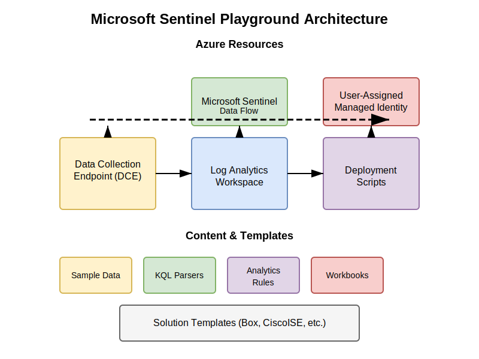

<svg xmlns="http://www.w3.org/2000/svg" width="100%" height="100" viewBox="0 0 320 80">
  <style>
    .text { font-family: Arial, sans-serif; font-weight: 900; text-anchor: middle; }
    .main-text { font-size: 32px; fill: #2c3e50; }
    .tagline { font-size: 16px; fill: #7f8c8d; }
    .accent { fill: #3498db; }
  </style>
  <text x="160" y="40" class="text main-text">Risk<tspan class="accent">Logic</tspan>Group</text>
  <text x="160" y="65" class="text tagline">Security Intelligence Solutions</text>
</svg>

# Microsoft Sentinel Playground

[](https://github.com/RiskLogicGroup/Sentinel-playground/releases)
[]()
[](http://makeapullrequest.com)

[](https://portal.azure.com/#create/Microsoft.Template/uri/https%3A%2F%2Fraw.githubusercontent.com%2FRiskLogicGroup%2FSentinel-playground%2Fmain%2FARM-Templates%2Fazuredeploy.json/createUIDefinitionUri/https%3A%2F%2Fraw.githubusercontent.com%2FRiskLogicGroup%2FSentinel-playground%2Fmain%2FARM-Templates%2FUiDefinition.json)

## Overview

The Microsoft Sentinel Playground is an enterprise-grade solution that provides a comprehensive, pre-configured Azure Sentinel environment with sample data, analytics rules, parsers, workbooks, and hunting queries for multiple security solutions. This deployment accelerator is designed for proof of concept, demonstrations, and training scenarios, enabling security teams to rapidly evaluate and understand Microsoft Sentinel's capabilities.

## Architecture

The Sentinel Playground implements a modern cloud-native architecture leveraging the latest Azure resource types and APIs. The solution follows these architectural principles:

- **Modularity**: Each data source is implemented as a separate linked template
- **Infrastructure as Code**: Entire environment provisioned through ARM templates 
- **Zero-touch deployment**: Fully automated configuration requiring minimal user input
- **Identity-based security**: Uses Managed Identities for authentication rather than keys or secrets
- **Modern pipeline architecture**: Utilizes Data Collection Endpoints (DCE) and Data Collection Rules (DCR)

### Technical Components



#### Core Infrastructure

1. **Log Analytics Workspace**: The central repository for all security logs and events
2. **Microsoft Sentinel**: Enabled on the workspace for SIEM and SOAR capabilities
3. **User-Assigned Managed Identity**: Securely handles deployment operations without secrets
4. **Data Collection Endpoint (DCE)**: Entry point for the Logs Ingestion API
5. **Data Collection Rule (DCR)**: Defines data processing and routing to the workspace
6. **DCR Association**: Links the DCR to the Log Analytics workspace

#### Data Processing Pipeline

1. **Sample Data Ingestion**:
   - Sample JSON logs from the `/samples/` directory
   - Data enriched with `LogSourceType` field for source tracking
   - Ingested via Azure Monitor Logs Ingestion API to the `RiskLogicGroup_CL` custom table
   - Managed using PowerShell deployment scripts in containers

2. **KQL Parsers**:
   - Deployed as saved searches/functions in the workspace
   - Transform raw `RiskLogicGroup_CL` data into structured, normalized tables
   - Support various data source formats (CrowdStrike, Box, Cisco ISE, etc.)

3. **Analytics Rules**:
   - Pre-configured detection rules linked to specific data sources
   - Entity mappings for UEBA and investigation capabilities
   - Customizable severity, frequency, and suppression settings

4. **Workbooks and Hunting Queries**:
   - Visual dashboards for data exploration and threat hunting
   - Pre-configured hunting queries for common attack patterns

## Supported Solutions

The playground includes comprehensive support for the following security solutions:

| Vendor | Data Type | Parsers | Analytics | Workbooks | Hunting Queries |
|--------|-----------|---------|-----------|-----------|-----------------|
| Box | Activity Logs | ✓ | ✓ | ✓ | ✓ |
| Cisco ISE | Security Events | ✓ | ✓ | ✓ | ✓ |
| Cisco Umbrella | DNS Logs | ✓ | ✓ | ✓ | ✓ |
| CrowdStrike | Endpoint Detection | ✓ | ✓ | ✓ | ✓ |
| Ping Federate | Authentication | ✓ | ✓ | ✓ | ✓ |
| Palo Alto | Firewall Logs | ✓ | ✓ | ✓ | ✓ |
| Ubiquiti | Network Logs | ✓ | ✓ | ✓ | ✓ |

## Deployment Architecture

The Sentinel Playground utilizes a nested ARM template architecture:

```
azuredeploy.json (main template)
├── UiDefinition.json (portal UI experience)
├── Log Analytics + Sentinel resources
├── Data Collection Infrastructure (DCE/DCR)
├── Managed Identity + Role Assignments
├── Deployment Scripts (PowerShell in containers)
│   ├── Sample Data Ingestion
│   ├── Parser Deployment
│   └── Analytics Rule Configuration
└── LinkedTemplates/solutions.json
    ├── Box/mainTemplate.json
    ├── CiscoISE/mainTemplate.json
    ├── CiscoUmbrella/mainTemplate.json
    ├── CrowdStrike/mainTemplate.json
    ├── PingFederate/mainTemplate.json
    ├── PaloAlto/mainTemplate.json
    └── Ubiquiti/mainTemplate.json
```

### Deployment Flow

1. **Infrastructure Provisioning**:
   - Log Analytics workspace creation
   - Microsoft Sentinel enablement
   - Standard connector configuration (Azure Activity, Security Events)
   - Managed Identity provisioning with appropriate permissions
   - DCE/DCR creation and configuration

2. **Data Ingestion**:
   - Deployment script container execution
   - GitHub repository content retrieval
   - Sample data transformation and ingestion
   - Parser deployment

3. **Solution Deployment**:
   - Linked template deployment based on selected solutions
   - Analytics rule, workbook, and hunting query deployment
   - Entity mapping configuration for investigation experiences

4. **Configuration**:
   - Analytics rule default parameter configuration
   - Workbook parameter configuration

## Deployment Prerequisites

- An Azure subscription with sufficient permissions
- Contributor access at the subscription or resource group level
- Modern browser supporting Azure Portal UI experiences
- Network connectivity to GitHub (for content retrieval)

## Deployment Instructions

### Option 1: Azure Portal Deployment (Recommended)

1. Click the "Deploy to Azure" button at the top of this README
2. Sign in to your Azure account if prompted
3. Complete the custom form with the following information:
   - Subscription: Select your Azure subscription
   - Resource Group: Create new or select existing
   - Region: Select deployment region
   - Workspace Name: Provide a name for your Log Analytics workspace
   - Data Providers: Select desired sample data sources
   - Data Connectors: Select desired connectors to enable
   - Solutions: Select desired Sentinel solutions to deploy
4. Review the terms and create the deployment

### Option 2: Azure CLI Deployment

```bash
# Clone the repository
git clone https://github.com/RiskLogicGroup/Sentinel-playground.git
cd Sentinel-playground

# Login to Azure
az login

# Set subscription context
az account set --subscription "Your-Subscription-Id"

# Create a resource group
az group create --name "SentinelPlayground" --location "WestEurope"

# Deploy the template
az deployment group create \
  --resource-group "SentinelPlayground" \
  --template-file ARM-Templates/azuredeploy.json \
  --parameters workspaceName="SentinelPlayground" \
               dataProviders='["Box","CiscoISE"]' \
               enabledSolutions='["Box","CiscoISE"]'
```

### Option 3: PowerShell Deployment

```powershell
# Clone the repository
git clone https://github.com/RiskLogicGroup/Sentinel-playground.git
cd Sentinel-playground

# Login to Azure
Connect-AzAccount

# Set subscription context
Set-AzContext -Subscription "Your-Subscription-Id"

# Create a resource group
New-AzResourceGroup -Name "SentinelPlayground" -Location "WestEurope"

# Deploy the template
New-AzResourceGroupDeployment `
  -ResourceGroupName "SentinelPlayground" `
  -TemplateFile "ARM-Templates/azuredeploy.json" `
  -workspaceName "SentinelPlayground" `
  -dataProviders @("Box","CiscoISE") `
  -enabledSolutions @("Box","CiscoISE")
```

## Technical Implementation Details

### Data Ingestion Pipeline

The Sentinel Playground uses a modern data ingestion architecture:

1. **Sample Data Storage**: JSON files in the `/samples/` directory organized by vendor
2. **Ingestion Process**:
   - PowerShell script (`Add-AzureMonitorData.ps1`) executed in a deployment script container
   - Managed Identity authentication for secure access
   - Data enrichment with `LogSourceType` field for source identification
   - Batched API calls to the Logs Ingestion API endpoint

### Parser Implementation

Parsers are implemented as KQL functions:

1. **File Format**: `.csl` files in the `/parsers/` directory
2. **Deployment Method**:
   - Added as saved searches with function aliases
   - Automatically updated to reference the `RiskLogicGroup_CL` table
   - Accessible through their aliases in KQL queries

### Analytics Rules

Analytics rules are implemented in the solution-specific templates:

1. **Definition**: JSON configurations in linked templates
2. **Features**:
   - Entity mappings for investigation experiences
   - Customizable query frequency and period
   - Severity and suppression settings
   - MITRE ATT&CK tactic and technique mappings

### Resource Naming and Organization

The solution follows these naming conventions:

- **Resource Names**: Consistent prefixing and suffixing (e.g., `dce-{workspaceName}-{uniqueString}`)
- **Template Organization**: Modular structure with linked templates
- **Parameter Passing**: Consistent parameter passing between templates

## Performance Considerations

The Sentinel Playground is optimized for demonstration environments:

- **Resource Sizing**: Log Analytics workspace uses the cost-optimized `PerGB2018` pricing tier
- **Data Retention**: 30-day default retention period
- **Sample Data Volume**: Optimized to provide meaningful analysis without excessive storage costs

## Security Considerations

The solution follows security best practices:

- **Authentication**: Managed Identity for all operations requiring authentication
- **Authorization**: Minimal RBAC permissions for the deployment identity
- **Data Protection**: No storage of sensitive credentials or keys

## Customization Options

The solution can be customized in several ways:

1. **Adding New Data Sources**:
   - Add JSON sample files to the `/samples/` directory
   - Create corresponding parsers in the `/parsers/` directory
   - Add analytics rules, workbooks, and hunting queries

2. **Modifying Analytics Rules**:
   - Update detection logic in the linked templates
   - Use the `Update-DetectionRules.ps1` script to apply changes

3. **Custom Deployment Parameters**:
   - Modify the `azuredeploy.json` parameters section
   - Update the `UiDefinition.json` file for the portal experience

## Troubleshooting

Common issues and their solutions:

1. **Deployment Failures**:
   - Check the deployment script logs in the Azure Portal
   - Verify managed identity permissions
   - Ensure network connectivity to GitHub

2. **Missing Data**:
   - Verify DCE/DCR configuration
   - Check the `RiskLogicGroup_CL` table for ingested data
   - Review parser functions for errors

3. **Analytics Rule Issues**:
   - Verify entity mapping configurations
   - Check KQL syntax in query definitions
   - Review parser references in queries

## Contributing

Contributions to the Sentinel Playground are welcome. Please follow these steps:

1. Fork the repository
2. Create a feature branch
3. Make your changes
4. Submit a pull request

## License

This project is licensed under the MIT License - see the LICENSE file for details.

## Acknowledgments

- Microsoft Sentinel team for their ongoing development of Sentinel capabilities
- RiskLogicGroup team for their development and maintenance of this solution
- Visit [RiskLogicGroup.com](https://www.risklogicgroup.com) for more security solutions and expertise
